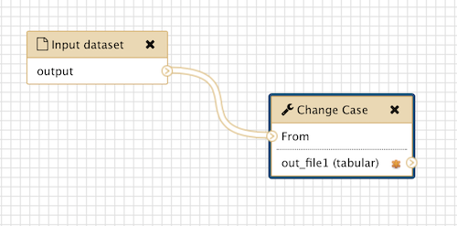
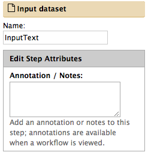
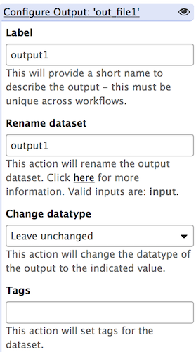

A first example
===============

This first example shows how to configure a **wft4galaxy** workflow test
for Galaxy.

Main steps:

1. prepare the Galaxy workflow to test by doing a consistency checking
   and download its **.ga** file;
2. choose its **input datasets** and define which are its **expected
   outputs**;
3. write a workflow test **configuration file**;
4. launch wft4galaxy to execute the test.

1. Workflow preparation
-----------------------

Consider the following simple workflow **''ChangeCase''** which simply
changes (to upper) the case of an input text by using only one Galaxy
text transformation tool, i.e., the *ChangeCase* tool.

.. raw:: html

   

|wf-changecase-workflow|

.. raw:: html

   

.. raw:: html

   

**Figure 1.** Workflow *"ChangeCase"*

.. raw:: html

   

As the fig.1 shows, the workflow has one input and one output. In order
to test it the both of them must be uniquely identified. Tipically,
Galaxy identifies them using labels:

-  **"Input Dataset"** for the input (fig.2);
-  **"output1"** for the output (fig.3).

.. raw:: html

   

.. raw:: html

   

.. raw:: html

   

|wf-changecase-inputdataset|

.. raw:: html

   

.. raw:: html

   

**Figure 2.** Workflow input: *"Input Dataset"*

.. raw:: html

   

.. raw:: html

   

.. raw:: html

   

.. raw:: html

   

|wf-changecase-outputdataset|

.. raw:: html

   

.. raw:: html

   

**Figure 3.** Workflow output: *"output1"*

.. raw:: html

   

.. raw:: html

   

.. raw:: html

   

Satisfied that both input and outputs are uniquely identified, we can
download the Galaxy workflow definition, i.e., the **.ga** file. To
obtain the .ga file you have to select the workflow you are interested
in from the *Workflows* menu of the Galaxy web interface and then click
*Share or Download* and finally click the button *Download*.

    In principle, we could support another scenario in which you do not
    need to do the boring step of downloading the .ga file. In the next
    version of our tool will allow users to simply specify which the
    workflow that they want to test without requiring any explicit
    download for them.

2. Choose inputs and expected outputs
-------------------------------------

As workflow input, we can use any text file (e.g.,
``examples/change_case/input.txt``) and, as expected output, a file
containing the same text of the former but in upper case (e.g.,
``examples/change_case/expected_output.txt``).

3. Define the workflow test configuration
-----------------------------------------

The code below shows a very simple example of workflow test
configuration file (i.e., ``workflows-test.yml``):

.. code:: yaml

    workflows:
      # workflow test "change case"
      change_case:
        file: "change_case/workflow.ga"
        inputs:
          "Input Dataset": "change_case/input"
        expected:
          output1: "change_case/expected_output_1"

See :ref:`config-file` for more details about the legal
syntax of the configuration file. # FIXME: switch the right link

4. Execute the configured test
------------------------------

The only mandatory parameter to run the test is the configuration file,
which can be specified using the option ``-f | --file`` of the
``wft4galaxy`` script:

.. code:: bash

  $ wft4galaxy -f examples/workflows-base.yml
  Workflow Test: 'change_case' ... ok

  ----------------------------------------------------------------------
  Ran 1 test in 18.352s

  OK
